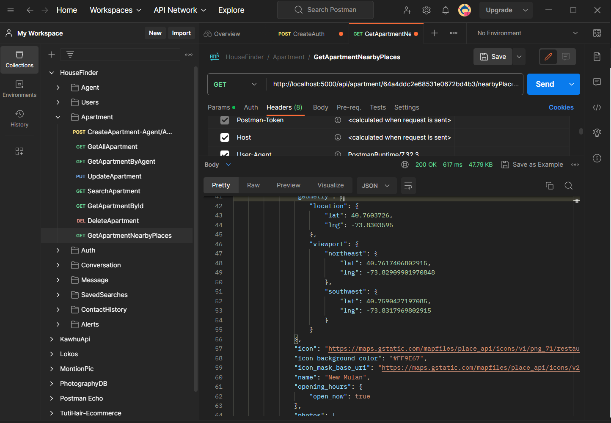
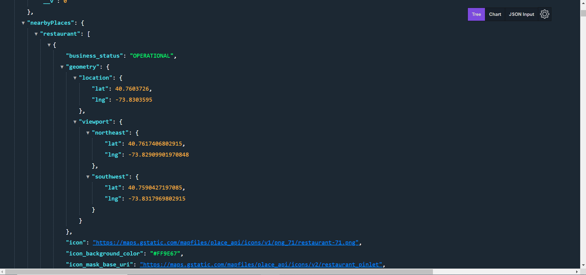

# ApartmentFinder: Code sample of GeoFinder Web App 
## Screenshots
   

Hey there, this is a code sample of my ongoing project named Geofinder which is a web app that simplifies the process of finding apartments

 The presented code examples pertain to two distinct aspects of a project, namely: a utility module called mapApi.js and a Controller module called Apartment Controller.

### Understanding the mapApi.js Utility Module

The mapApi.js utility module encapsulates three crucial functions: fetchNearByPlaces, getFilteredPlaces, and getFilteredAndCategorizedPlaces.

The fetchNearByPlaces function is an asynchronous operation that fetches data concerning nearby places based on provided latitude, longitude, and place type. It first checks if the queried data is already cached in Redis. If it is, it returns the cached data, thereby reducing unnecessary network calls and improving efficiency. However, if the data is not found in the cache, it fetches the data by making an API call to the Google Places API, storing the received data in Redis cache for subsequent use.

The functions getFilteredPlaces and getFilteredAndCategorizedPlaces extend the capabilities of the fetchNearByPlaces function. They fetch data about nearby places for multiple categories and generate a filtered list of places. Additionally, getFilteredAndCategorizedPlaces groups the places based on their categories.

### Analysing the Apartment Controller Module

The Apartment Controller module is responsible for managing different operations related to apartments. It contains functions to fetch all apartments, retrieve a single apartment by ID, find apartments by agent ID, and importantly, retrieve nearby places for an apartment.

The getApartmentNearbyPlaces function within this module demonstrates an effective use of the utility functions in mapApi.js. By using the geographic coordinates of an apartment, it invokes the utility functions to get a list of nearby places, and categorizes and filters them based on the provided criteria. The resultant data is then appended to the apartment information, enriching the dataset and offering potential users more comprehensive insights about the apartment's location.

### Assessing the Significance of the Code

The presented code is a testament to effective software design principles. It is not only successful in fulfilling its functional requirements but also demonstrates an efficient use of system resources. The use of Redis as a caching mechanism, for instance, optimises the application by reducing redundant API calls, thereby improving the system's performance and response time.

Furthermore, the code showcases how a balance between theory and practice can be achieved. It integrates various tools and technologies, such as the Google Places API, Node.js, Express, and Redis, to solve a real-world problem - in this case, enhancing the process of apartment hunting.

In essence, the analyzed code signifies the importance of an efficient design, performance optimization, and the practical application of theoretical concepts in software development. It's an excellent example for developers looking to combine robust functionality with optimal performance. 🎉
